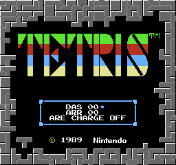
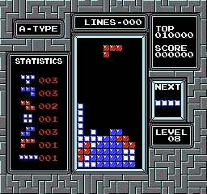
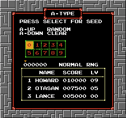
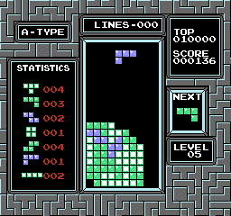

# NES Tetris Hacks

To set up the repository, see [INSTALL.md](INSTALL.md)

These are various romhacks of the NES game Tetris.

Run:
`./build.sh`

| Flag        | Filename    | Description            | 
| ----------- | ----------- |------------------------|
|             |`Tetris.nes`| Vanilla                |
| `-a`        | `Aep`      | Debug mode.  Every drop is a tetris.  Select to end game.  (Not yet implemented) |
| `-b`        | `Bdb`      | Debug mode.  B-Game requires no lines to win |
| `-f`        | `Flt`      | Debug mode.  Piece floats unless select is pressed (Not yet implemented) |
| `-H anydas` | `Any`      | HydrantDude's [Anydas](#anydas) |
| `-H penguin`| `Plc`      | [Penguin Line Clear](#penguin-line-clear) |
| `-H sps`    | `Sps`      | Kirjava's [Same Piece Sets](#same-piece-sets) |
| `-H wallhack2`| `Wh2`    | [Wall Hack 2](#wallhack-2) |
| `-l`        | `S`        | Skippable legal screen |
| `-m 3`      | `Cnrom`    | Use CNROM INES Mapper  |

Multiple hacks are compatible unless otherwise noted, for example to build Penguin Line Clear with Anydas:

    build.sh -H anydas -H penguin

## Anydas

Credit to [HydrantDude](https://www.youtube.com/@hydrantdude3642)

Anydas skips the legal screen and provides a menu that allows for a customized Delayed Auto Shift (DAS) experience.  The DAS setting, presented in hexadecimal, controls the initial delay in number of frames.  The Auto Repeat Rate (ARR), also presented in hexadecimal, controls how many frames between shifts after the initial delay.   The ARE Charge setting when enabled allows the DAS charge to occur during entry delay.   

See [this page](https://tetris.fandom.com/wiki/ARE) for an explanation of ARE.

    -H anydas

## Penguin Line Clear

The line clearing animation has been replaced with a penguin that clears the blocks for you.

    -H penguin

## Same Piece Sets

Credit to [Kirjava](https://kirjava.xyz/)

Provides an option to enter a seed value that determines the piece sequence.  100% compatible with [TetrisGYM](https://github.com/kirjavascript/TetrisGYM)

    -H sps

## Wallhack 2

Provides a wraparound experience similar to the vertical levels of Super Mario Bros. 2.  

    -H wallhack2

## Thanks

[CelestialAmber](https://github.com/CelestialAmber/TetrisNESDisasm) Repo from which this is derived

[ejona86](https://github.com/ejona86/taus) Repo from which above repo is derived and info file

[qalle2](https://github.com/qalle2/nes-util) CHR tools

[kirjavascript](https://github.com/kirjavascript/TetrisGYM) borrowed bits

